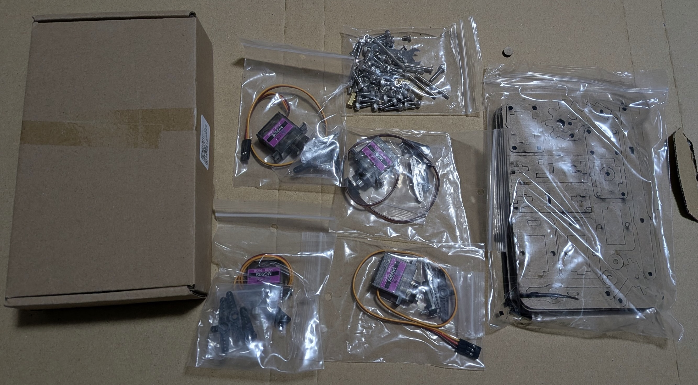

# Beginning Physical AI

最安価4-DoFロボットアーム（アクリル製）

## Qiita記事投稿

1. [Lチカから始めるフィジカルAI: Gemini Live + SvelteKit + Arduino UNO](https://qiita.com/araobp/items/5ac9b141c64e4967b61e)
2. [おもちゃのロボットアームでフィジカルAIを網羅的に勉強したい 〜 その１：ロボット準備編](https://qiita.com/araobp/items/b34a5c64f281f09d3d89)
3. [おもちゃのロボットアームでフィジカルAIを網羅的に勉強したい 〜 その２：ロボットコントローラ編](https://qiita.com/araobp/items/0776cc494c6963fc61ad)
4. [おもちゃのロボットアームでフィジカルAIを網羅的に勉強したい 〜 その３：MCPサーバ編](https://qiita.com/araobp/items/d5ba84f84527ebcf72a1)
5. [おもちゃのロボットアームでフィジカルAIを網羅的に勉強したい 〜 その４：ロボットの目編](https://qiita.com/araobp/items/510b497c3415f7f42f76)
6. [おもちゃのロボットアームでフィジカルAIを網羅的に勉強したい 〜 その５：MCPクライアント編](https://qiita.com/araobp/items/f70e27586f46bbd7ba45)
7. [おもちゃのロボットアームでフィジカルAIを網羅的に勉強したい 〜 その６：VLA検証準備編](https://qiita.com/araobp/items/f4a5af993a2fe730f373)

## おもちゃのロボットアームでフィジカルAIを網羅的に勉強したい ソースコード

### 準備ツール

- [カメラ歪み補正、ArUcoマーカー](https://github.com/araobp/beginning-physical-ai/tree/main/python/vision)
- [転移学習(YOLO11 Nano向け、開発中)]()

### フィジカルAIシステム（開発中）

- [Robot Controller](https://github.com/araobp/beginning-physical-ai/tree/main/arduino/robot_controller)
- [MCP Server](https://github.com/araobp/beginning-physical-ai/tree/main/python/mcp_server)
- [MCP Client](https://github.com/araobp/beginning-physical-ai/tree/main/sveltekit/mcp_client)

## 部品・ツール

### 4DoFロボットアーム

Amazonで購入：[4DoFロボット](https://www.amazon.co.jp/dp/B0CX8QZVFQ?ref=ppx_yo2ov_dt_b_fed_asin_title)

組み立てマニュアル：
- https://www.makerbuying.com/docs/4dofarm/over-view
- https://www.youtube.com/watch?v=Q9JOKQaIR1w

Google検索エンジンの言語設定を英語にして、"SNAM 1200 1300 1500 4 DOF ARM acrylic robot arm"で検索すると、たくさん出てくる。

### NXP PCA9685 PWMコントローラ

Amazonで購入：[KKHMF PCA9685 16チャンネル 12-ビット PWM Servo モーター ドライバー IIC モジュール](https://www.amazon.co.jp/dp/B078YRJ8D7)

I2C address: 0x40 (A0 - A5 の端子を半田付けしてクローズすることでアドレス変更可能だが、今回はこのままで良し）。

- ガイド：https://en.hwlibre.com/Complete-guide-to-the-PCA9685-controller-with-Arduino-and-more/
- データシート：https://cdn-shop.adafruit.com/datasheets/PCA9685.pdf
- Arduinoライブラリ：https://github.com/adafruit/Adafruit-PWM-Servo-Driver-Library

ArduinoのI2C通信では、Wire.begin();を実行すると、デジタルピン2と3（SDA, SCL）に内部プルアップ抵抗が自動的に有効になりますが、これはおよそ20kΩ〜50kΩと抵抗値が比較的高めなので、より確実な通信のためには、通常4.7kΩ〜10kΩ程度の外付けプルアップ抵抗をSDA/SCLラインに接続するのが推奨されます。Wire.begin()だけでは不十分な場合があるため、外部抵抗の追加を検討しましょう。

## 関連する私のGitHubプロジェクト

- Gemini Robotics-ERでUnity上の多軸ロボットを制御(Unity)　=> https://github.com/araobp/unity-robotics
- Gemini Liveで博物館内展示の自動音声応対(SvelteKit, Godot) => https://github.com/araobp/godot-museum
- Arduinoで赤外線アレイセンサー(異常検知に使える？) => https://github.com/araobp/arduino-infrared-array-sensor
- 空港内MCPやロボット巡回(Godotの3D機能が弱く中断、このプロジェクト終わったらUnity版で再開させたい) => https://github.com/araobp/airport
- バーチャルショールーム、照明ムード自動調整のところ、若干、フィジカルAIっぽい => https://github.com/araobp/virtual-showroom
- 昔作った建機の自動運転シミュレーション、YouTubeへ動画上げたら結構いいね沢山もらえた => https://github.com/araobp/unity-excavator

## 読みたい論文
- [Gemini Robotics](https://arxiv.org/pdf/2503.20020)
- [Gemini Robotics 1.5](https://arxiv.org/pdf/2510.03342)
- [Robot Learning: A Tutorial](https://arxiv.org/pdf/2510.12403v1)
